# ❤️ Real-time IoT and Cloud Enabled Health Monitoring Band for Cardiac Activity

A wearable health monitoring system that continuously tracks **Heart Rate (BPM)** and **SpO₂**, streams the data to the cloud in real time, and keeps family members informed through a companion mobile app — complete with **live location sharing**, **nearby hospital discovery**, and **automated emergency alerts**.

Built as a Final Year Design Project, this system combines an **ESP32 + MAX30102** wearable, a fully **serverless AWS backend**, a **Flutter** mobile app, and **Terraform**-managed infrastructure.

---

## 📌 Motivation: The Rising Burden of Cardiovascular Disease

Cardiovascular diseases (CVDs) remain the single leading cause of death worldwide, and the numbers continue to climb:

- An estimated **19.8 million deaths** in 2022 were attributed to cardiovascular disease — roughly **32% of all deaths globally**.
- Global CVD mortality has risen sharply over the past three decades, climbing from around **13.1 million deaths in 1990 to 19.2 million in 2023**.
- The number of people living with cardiovascular disease has **more than doubled since 1990**, growing from **311 million to 626 million cases**.
- The burden falls disproportionately on **low- and middle-income countries**, which account for over three-quarters of all CVD-related deaths.

This scale of impact makes continuous, accessible, and affordable cardiac monitoring more critical than ever.

## ⚠️ Limitations of Existing Solutions

**Hospital-Grade Devices**
- Bulky and expensive, not designed for everyday wear
- Intended for short-term clinical use rather than continuous monitoring
- Impractical for daily, at-home use
- Little to no automated emergency alerting
- Rarely integrated with the cloud for remote access

**Consumer Wearables**
- Built for fitness tracking, not medical-grade accuracy
- Accuracy limitations that make them unreliable for health decisions
- Minimal or no cloud integration for long-term health records
- Little to no automated emergency response
- Devices that do offer better accuracy tend to be prohibitively expensive

## ✅ Our Solution

This project bridges that gap with an **IoT and cloud-enabled health monitoring band** that is affordable, wearable, and connected:

- Continuous monitoring of **Heart Rate**, **SpO₂**
- **Real-time data transmission** to the cloud and mobile app
- **Automated emergency alerts** the moment vitals fall outside a safe range

### Key Features

- 📡 **Real-time vitals monitoring** — live BPM and SpO₂ readings on both the device LCD and the mobile app
- ☁️ **Cloud storage with historical health records** — every reading is timestamped and stored for long-term trend analysis
- 🚨 **Automated emergency alerts via email** — triggered instantly when readings cross critical thresholds
- 👨‍👩‍👧 **Emergency contact management system** — add and manage the people who should be notified during a health event
- 🗺️ **GPS location sharing & nearby hospital navigation** — powered by Google Maps, so help can find the wearer fast

<p align="center">
  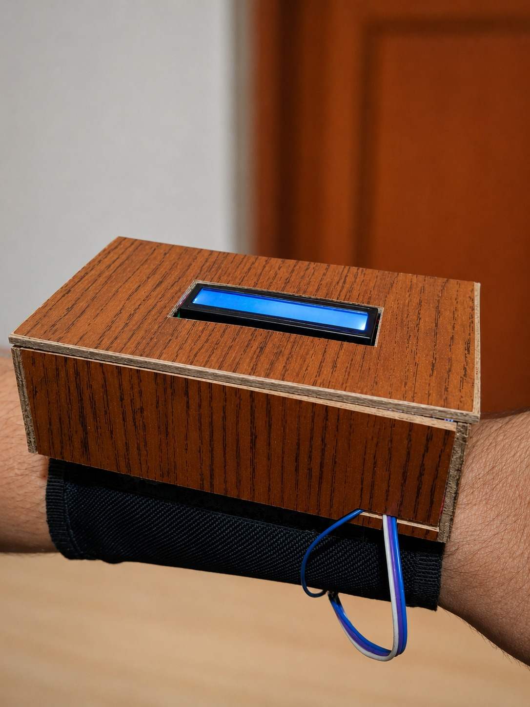
</p>

<p align="center"><i>The wearable band housing the ESP32, MAX30102 sensor, and LCD, worn on the wrist</i></p>

---

## 🏗️ System Architecture

Data flows from the wearable sensor all the way to the mobile app through a fully serverless AWS pipeline:

<p align="center">
  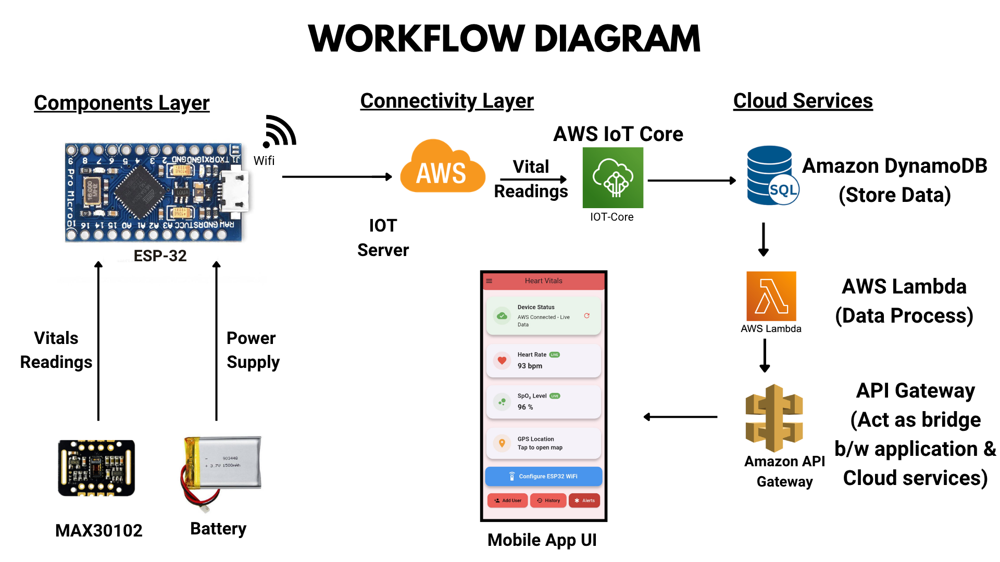
</p>

**Flow:**
`MAX30102 Sensor` → `ESP32 (I²C)` → `WiFi` → `AWS IoT Core` → `DynamoDB` → `Lambda` → `API Gateway` → `Flutter Mobile App`

- **AWS IoT Core** receives live vital readings from the ESP32 over MQTT
- **Amazon DynamoDB** stores every reading for historical access
- **AWS Lambda** processes incoming data and handles business logic (thresholds, alerts, history queries)
- **Amazon API Gateway** acts as the bridge between the mobile app and the backend cloud services

---

## 🔩 Hardware Integration

### ESP32 ↔ MAX30102 (I²C Communication)

The MAX30102 pulse oximeter sensor communicates with the ESP32 over the **I²C protocol** — chosen specifically for its low power draw and suitability for wearable devices.

| MAX30102 Pin | ESP32 Pin |
|---|---|
| SDA | GPIO 21 |
| SCL | GPIO 22 |
| VCC | 3.3V |
| GND | GND |

The ESP32 acts as the I²C **master**, with the MAX30102 as the **slave**, and is powered through a portable battery source for full wrist-worn mobility.

<p align="center">
  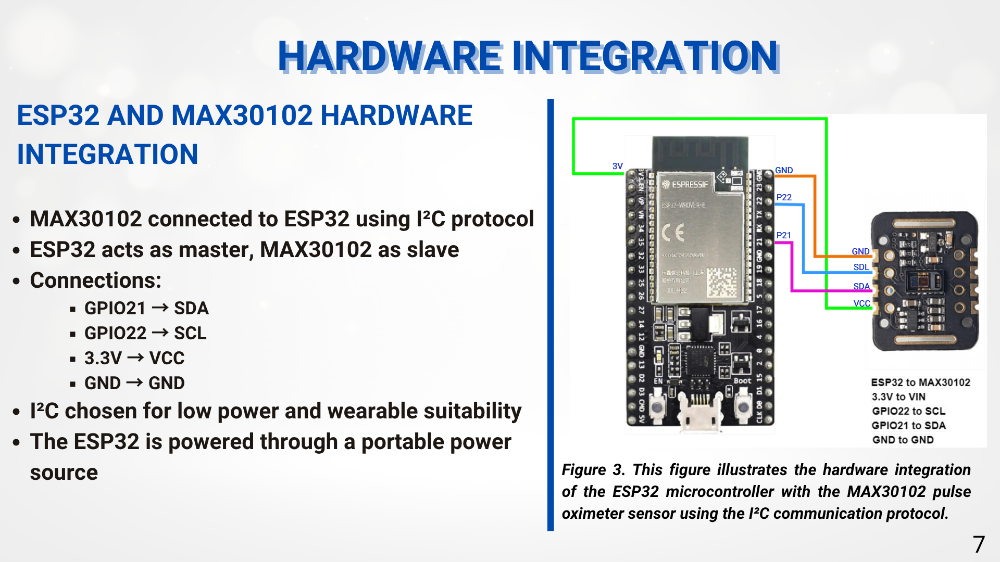
</p>

### How the MAX30102 Sensor Works

The MAX30102 uses **optical sensing (PPG — Photoplethysmography)** to measure heart rate and SpO₂:

1. Onboard **Red and IR LEDs** emit light into the skin
2. A **photodiode** detects the light reflected back
3. Reflected light intensity varies with blood volume changes in the capillaries
4. These variations are converted to digital signals and sent to the ESP32 via I²C for filtering, heart rate calculation, and SpO₂ measurement

<p align="center">
  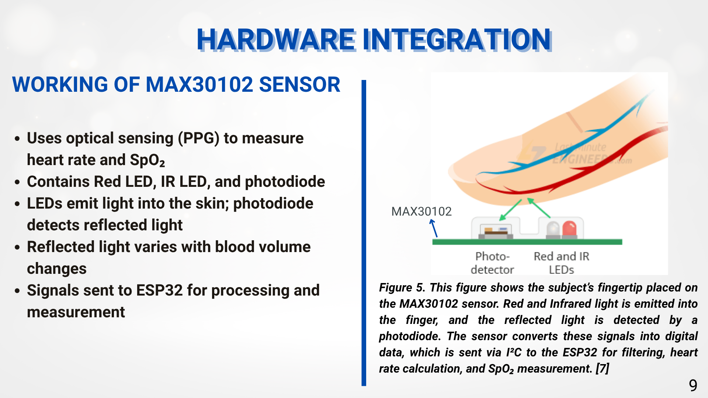
</p>

### On-Device LCD Display

A 16×2 LCD gives the wearer real-time vitals directly on the device — no phone required:

- Displays Heart Rate (BPM) in real time
- Displays SpO₂ (%) in real time
- Allows standalone monitoring without needing the mobile app

| LCD Pin | ESP32 Pin |
|---|---|
| SDA | GPIO 21 |
| SCL | GPIO 22 |
| VCC | 5V |
| GND | GND |

<p align="center">
  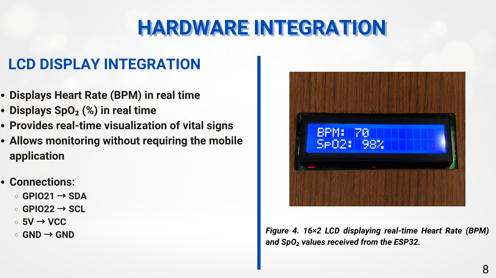
</p>

---

## 📱 App Screens

### Home Dashboard
Live device status, real-time Heart Rate and SpO₂ readings, quick access to GPS location, WiFi configuration, history, and alerts.

<p align="center">
  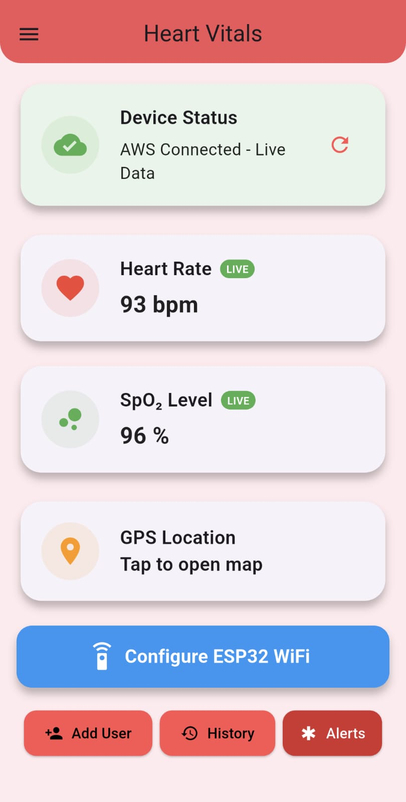
</p>

### Band + App in Action
The wearable band paired with the app, showing matching live BPM and SpO₂ readings between the device LCD and the mobile dashboard.

<p align="center">
  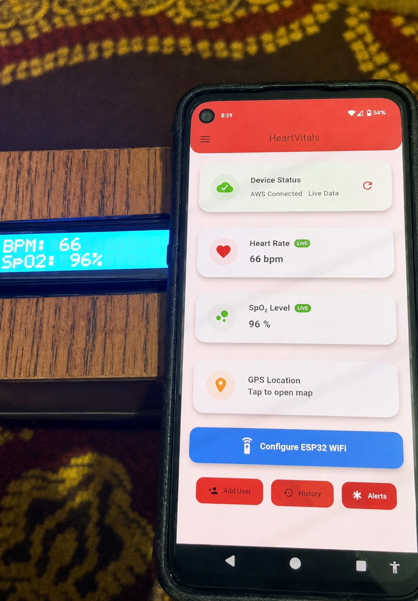
</p>

### ESP32 WiFi Configuration
A guided, step-by-step setup flow lets users connect a brand-new ESP32 device to their home WiFi network directly from the app.

<p align="center">
  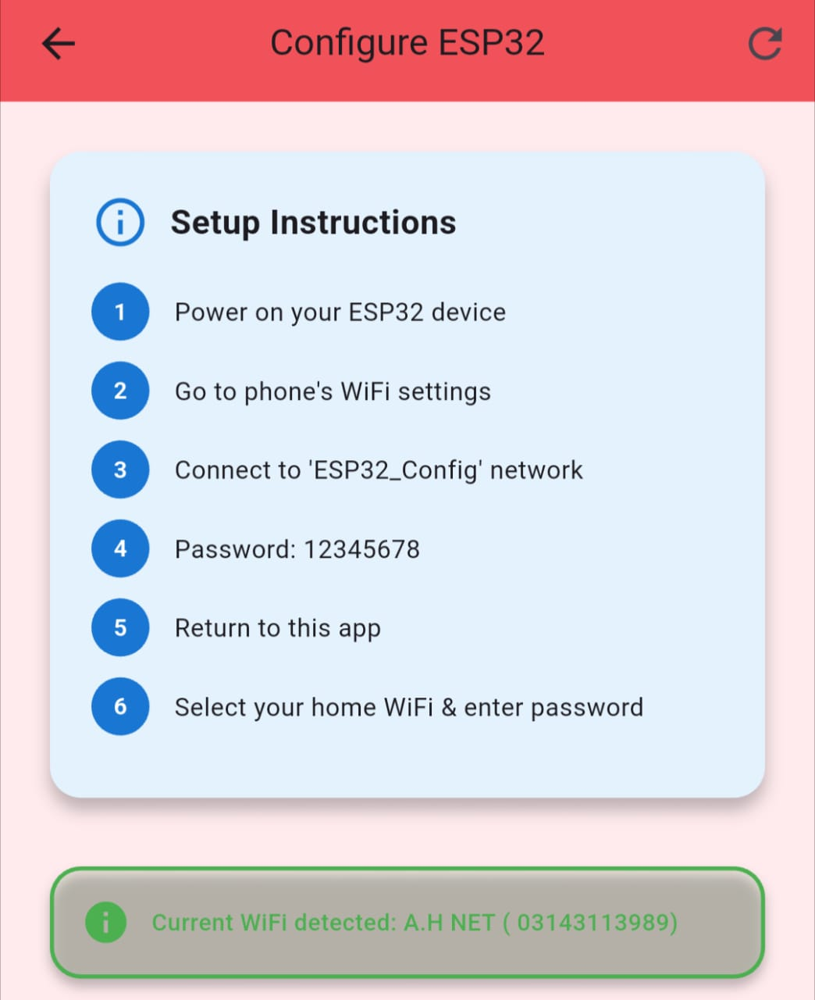
  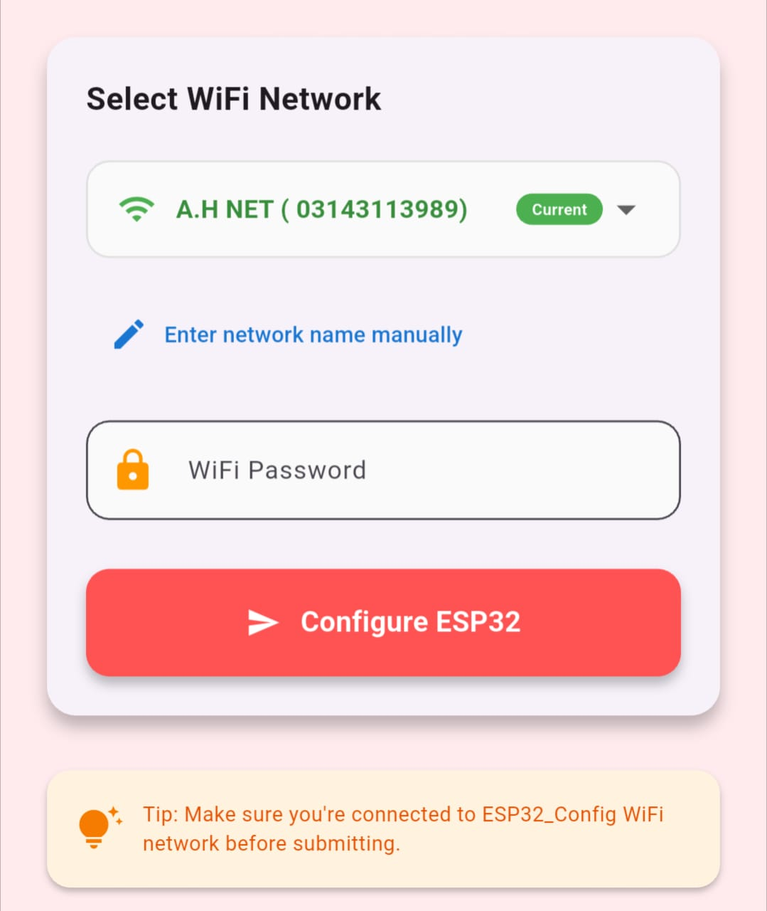
</p>

### Heart Rate History
A 30-day summary of average Heart Rate and SpO₂, alongside a full log of individual readings with normal/low status indicators.

<p align="center">
  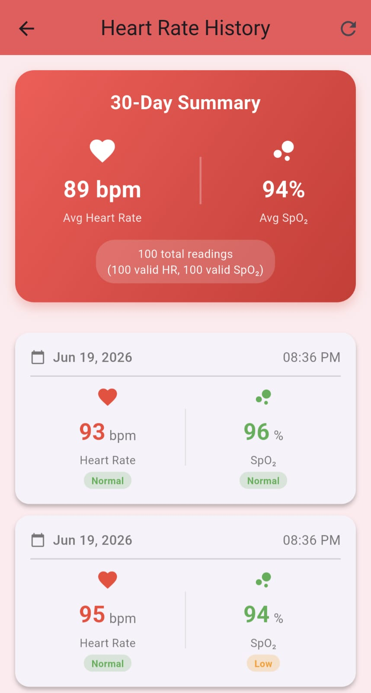
</p>

### Emergency Contacts & Alerts
Users can manage up to 5 emergency contacts, and trigger an emergency alert that instantly shares live vitals and GPS location.

<p align="center">
  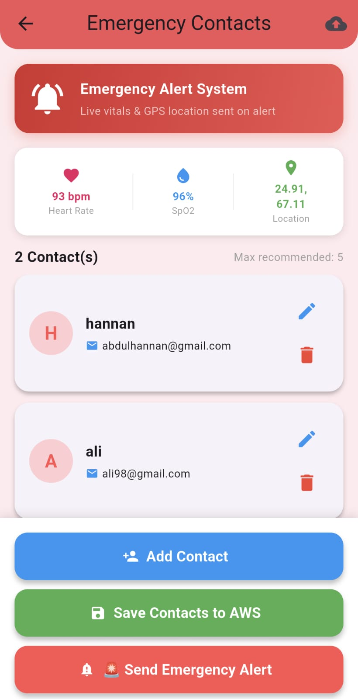
</p>

### Nearby Hospitals
Integrated with Google Maps to locate and navigate to the nearest hospitals in an emergency.

<p align="center">
  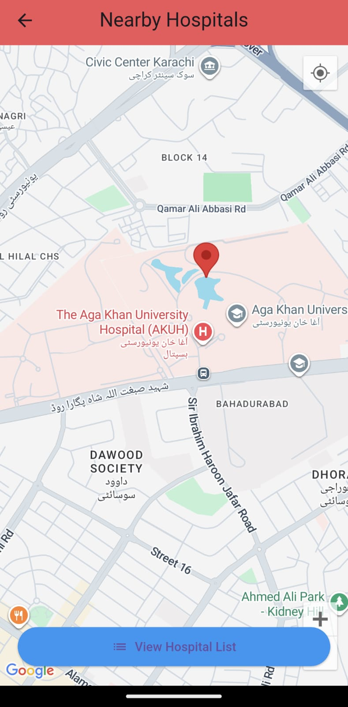
</p>

---

## 🛠 Technologies Used

### Frontend
- **Flutter** — Cross-platform mobile development
- **Dart** — Programming language
- **google_maps_flutter**, **geolocator**, **url_launcher** — Location, mapping, and hospital navigation (Haversine formula for distance, polyline route rendering)

### Hardware
- **ESP32 Microcontroller** — IoT device and I²C master
- **MAX30102 Sensor** — Optical Heart Rate & SpO₂ measurement
- **16×2 LCD** — On-device real-time vitals display

### Cloud Services (AWS)
- **AWS IoT Core** — Device connectivity (MQTT)
- **DynamoDB** — Data storage
- **Lambda** — Serverless compute & business logic
- **API Gateway** — REST API endpoints bridging app and cloud
- **SNS** — Emergency notifications

### Notifications
- **Firebase Cloud Messaging (FCM V1 API)** — Push notifications via Service Account-based JWT authentication

### Infrastructure
- **Terraform** — Infrastructure as Code for AWS resource provisioning

---

## 🚀 Getting Started

### Prerequisites
- Flutter SDK (3.x or higher)
- Android Studio / VS Code
- AWS Account
- ESP32 Development Board + MAX30102 Sensor
- Terraform CLI

### Installation

1. Clone the repository
```bash
git clone https://github.com/hannan-Devx/Cloud-Based-IoT-Health-Monitoring-System.git
cd Cloud-Based-IoT-Health-Monitoring-System
```

2. Install dependencies
```bash
flutter pub get
```

3. Run the app
```bash
flutter run
```

### AWS & Infrastructure Setup
1. Provision AWS resources using the Terraform configuration in `terraform-esp32/`
2. Create an IoT Thing in AWS IoT Core and generate device certificates
3. Deploy the Lambda functions found in `Lamda-Codes/`
4. Configure API Gateway endpoints
5. Set up the `cryptography` Lambda layer required for FCM V1 JWT signing

### ESP32 Setup
1. Flash the firmware (`arduinio_Working_Code.txt`) with device certificates
2. Power on the device and connect to its `ESP32_Config` WiFi network
3. Configure home WiFi credentials via the mobile app
4. Start monitoring — vitals will appear on both the LCD and the app

---

## 👥 Team

- **Abdul Hannan** —  — Cloud Backend & Mobile App: DynamoDB storage, serverless APIs (Lambda + API Gateway), Flutter integration, real-time vitals display, history retrieval,        emergency alerts, and Google Maps hospital navigation.
- **Huzaifa Kazim** — Hardware & Cloud Integration: integrated the ESP32 with the MAX30102 sensor and connected it to AWS IoT Core for secure data transmission.
- **Rayyan Ahmed Khan** — Hardware Build & Report: designed the wristband enclosure, embedded the MAX30102 directly into the strap for consistent skin contact, and authored the project report.
- **Hira Marium** — FYP Advisor

**NED University of Engineering & Technology** — Final Year Design Project, Batch 2022

## 📄 License

This project was developed as a Final Year Design Project (FYDP) for academic purposes.

## 🤝 Contributing

This is an academic project, but contributions and suggestions are welcome for educational purposes.
